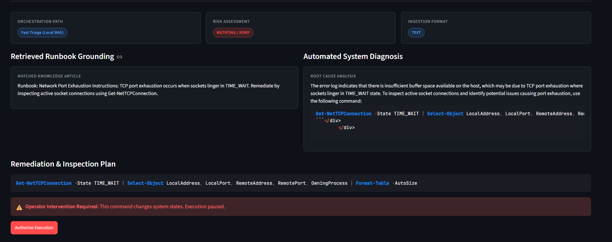
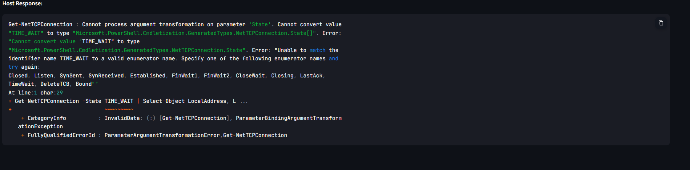

# ⚡ SentinelFlow: Autonomous Local-First Incident Response Agent

SentinelFlow is an autonomous Site Reliability Engineering (SRE) agent that triages system tracebacks, ingests server logs, searches grounded incident runbooks, and proposes safe remediation commands.

Designed for strict data privacy and zero API costs, SentinelFlow runs entirely locally using AMD GPU acceleration (via LM Studio), LangGraph state machine orchestration, and human-in-the-loop safety guardrails.

---

## 📖 Table of Contents

- [Key Features](#-key-features)
- [Architecture Workflow](#️-architecture-workflow)
- [Prerequisites](#-prerequisites)
- [Installation & Quickstart](#️-installation--quickstart)
- [Usage](#-usage)
- [Demo Video](#-demo-video)
- [Project Structure](#-project-structure)
- [LLMOps & Evaluation Benchmark](#-llmops--evaluation-benchmark)
- [Project Status](#-project-status)
- [Design Notes & Tradeoffs](#-design-notes--tradeoffs)
- [Future Work](#-future-work)

---

## 🚀 Key Features

* **Adaptive State Machine Routing:** Uses LangGraph to classify incoming errors dynamically, routing routine glitches to **Fast Triage** and complex issues (e.g., deadlocks, OOM spikes) to **Deep Chain-of-Thought Reasoning**.
* **Hybrid RAG Engine:** Combines dense semantic vector search (**Qdrant**, in-memory) with sparse exact-token matching (**BM25**), merged via Reciprocal Rank Fusion (RRF).
* **Cross-Encoder Reranking:** Applies `cross-encoder/ms-marco-MiniLM-L-6-v2` to evaluate retrieved runbook candidates, reducing irrelevant context and hallucinations before the model reasons over it.
* **Zero Cloud Costs & Local-First Privacy:** Model inference runs entirely locally via LM Studio using `Qwen2.5-Coder-7B-Instruct`, accelerated on an AMD RX 7800 XT GPU — no data ever leaves the machine, no API bill.
* **Human-in-the-Loop (HITL) Guardrails:** Proposed commands are inspected before execution. Read-only diagnostics run automatically; mutating or destructive actions require explicit operator confirmation before anything touches the system.
* **Interactive SRE Console:** Streamlit-powered dashboard with log file uploads, real-time routing badges (Fast Triage vs. Deep Reasoning), runbook grounding views, and execution approval controls.

---

## 🛠️ Architecture Workflow

```text
[Raw Error / Log File]
          │
          ▼
[1. Ingestion Node]         (Extracts trailing error tail, validates format)
          │
          ▼
[2. Complexity Router]
   ├── Routine Issue  ──► [Fast Triage Node]
   └── Critical Issue ──► [Deep Reasoning Node]
                               │
                               ▼
                 [3. Hybrid RAG + Reranker]
                  (BM25 + Qdrant + Cross-Encoder, via RRF)
                               │
                               ▼
                   [4. Diagnosis & Suggested Command]
                               │
                               ▼
                 [5. HITL Safety Guardrail]
                  ├── Safe  ──► Auto-Execute
                  └── Risky ──► Require Operator Approval
                               │
                               ▼
                      [PowerShell Execution]
```

**Node-by-node summary:**

1. **Ingestion** — takes a raw log or traceback, pulls out the relevant error tail, and normalizes it into a format the rest of the graph can reason over.
2. **Complexity Router** — a lightweight classification step that decides whether the issue is routine (fast path, cheaper/faster reasoning) or critical (slower, more thorough chain-of-thought reasoning).
3. **Hybrid RAG + Reranker** — pulls candidate runbook passages from both keyword search (BM25) and semantic search (Qdrant embeddings), fuses the two rankings, then re-scores the top candidates with a cross-encoder to keep only the most relevant grounding context.
4. **Diagnosis & Command** — the LLM produces a diagnosis and a proposed remediation command, grounded in the retrieved runbook context.
5. **HITL Safety Guardrail** — inspects the proposed command; safe read-only actions execute automatically, anything mutating or destructive is held for explicit human approval before it reaches the shell.

---

## 📋 Prerequisites

* **OS:** Windows 10/11
* **Python:** 3.10 or 3.11
* **Inference Server:** [LM Studio](https://lmstudio.ai/) serving `Qwen2.5-Coder-7B-Instruct` on `http://localhost:1234/v1`, with GPU acceleration enabled

---

## ⚙️ Installation & Quickstart

1. **Clone the repository:**
   ```powershell
   git clone https://github.com/<YOUR_GITHUB_USERNAME>/sentinelflow.git
   cd sentinelflow
   ```

2. **Set up virtual environment:**
   ```powershell
   python -m venv venv
   .\venv\Scripts\Activate.ps1
   ```

3. **Install dependencies:**
   ```powershell
   pip install -r requirements.txt
   ```

4. **Start LM Studio:**
   * Load `Qwen2.5-Coder-7B-Instruct`
   * Start the local server on port `1234`

5. **Run the SentinelFlow console:**
   ```powershell
   streamlit run app.py --server.fileWatcherType none
   ```

---

## 🖥️ Usage

1. Launch the console (Step 5 above) — it opens in your browser.
2. Upload a log file or paste a traceback into the input panel.
3. Watch the routing badge show whether it went to **Fast Triage** or **Deep Reasoning**.
4. Review the diagnosis and the retrieved runbook context that grounds it.
5. If a proposed command is flagged as **Risky**, review it and approve or reject before it executes. Safe, read-only commands run automatically.

*(Fill in any specific input format requirements, supported log types, or screenshots of the dashboard here.)*

---
## 🎬 Live Demonstrations

### Autonomous End-to-End Resolution (Safe Path)
<!-- Paste the GitHub video URL here, or use the GIF syntax below if it's a GIF -->


---

### Human-in-the-Loop (HITL) Safety Guardrail (Mutating Path)

When an incident remediation suggests mutating system state (e.g., terminating processes, restarting daemons), SentinelFlow arrests automatic execution and requires explicit human verification:

| 1. Risk Flag & Prompt | 2. Operator Authorization | 3. Host Remediation Execution |
| :---: | :---: | :---: |
|  |  |  |
</details>

---

## 📁 Project Structure

```
sentinelflow/
├── app.py                # Streamlit SRE console entry point
├── evaluate.py            # Automated evaluation suite (Ragas-style metrics)
├── requirements.txt        # Python dependencies
├── venv/                   # Local virtual environment (not committed)
├── [agent/graph modules]   # LangGraph nodes: ingestion, router, RAG, HITL
├── [runbooks/]              # Grounding documents indexed by Qdrant/BM25
└── README.md
```

*(Adjust file/folder names to match your actual repo layout.)*

---

## 📊 LLMOps & Evaluation Benchmark

SentinelFlow includes an automated evaluation suite (`evaluate.py`) that tests retrieval hit rate and context relevance:

```powershell
python evaluate.py
```

**Latest results:**

* **Total Test Cases:** 3
* **Retrieval Top-1 Hit Rate:** 100.0%
* **Mean Context Relevance:** 0.87 / 1.00

*Note: results are from a small (3-case) golden set. Worth growing this set before quoting these numbers in interviews, since a larger sample gives a more reliable picture.*

---

## ✅ Project Status

| Component | Status |
| --- | --- |
| Local Model Connected via LM Studio | ☑ Complete |
| LangGraph State Machine & Adaptive Routing | ☑ Complete |
| Human-in-the-Loop Safety Barrier | ☑ Complete |
| Hybrid RAG (BM25 + In-Memory Qdrant) | ☑ Complete |
| Cross-Encoder Reranking (`ms-marco`) | ☑ Complete |
| Log Ingestion Pipeline | ☑ Complete |
| Streamlit SRE Console | ☑ Complete |
| Automated Evaluation Suite (`evaluate.py`) | ☑ Complete |
| Observability Integration (Langfuse) | ☐ Planned |
| Image/Screenshot Input | ☐ Planned |

---

## 🧭 Design Notes & Tradeoffs

* **Why no vLLM:** vLLM's AMD/Windows support is limited and largely Linux-only. LM Studio was chosen instead to avoid a WSL2/ROCm setup, trading off direct PagedAttention benchmarking for a simpler, fully-local Windows workflow.
* **Why local-first:** Running everything on-device (Qwen2.5-Coder-7B via LM Studio) means zero API spend and no incident data leaving the machine — a real advantage for an SRE tool that may handle sensitive logs.
* **Why hybrid retrieval + reranking:** Keyword search alone misses paraphrased runbook matches; embeddings alone can drift on exact error codes. Combining both, then reranking, grounds answers more reliably than either alone.

---

## 🔭 Future Work

* Integrate Langfuse for full observability (token spend, latency, tool call success rate).
* Add multimodal input support (crash screenshots via a vision-capable model).
* Expand the golden evaluation set beyond 3 cases for more statistically meaningful metrics.
* Add a fallback to a free-tier hosted model (e.g. Groq/Gemini) for cases the local model handles poorly.